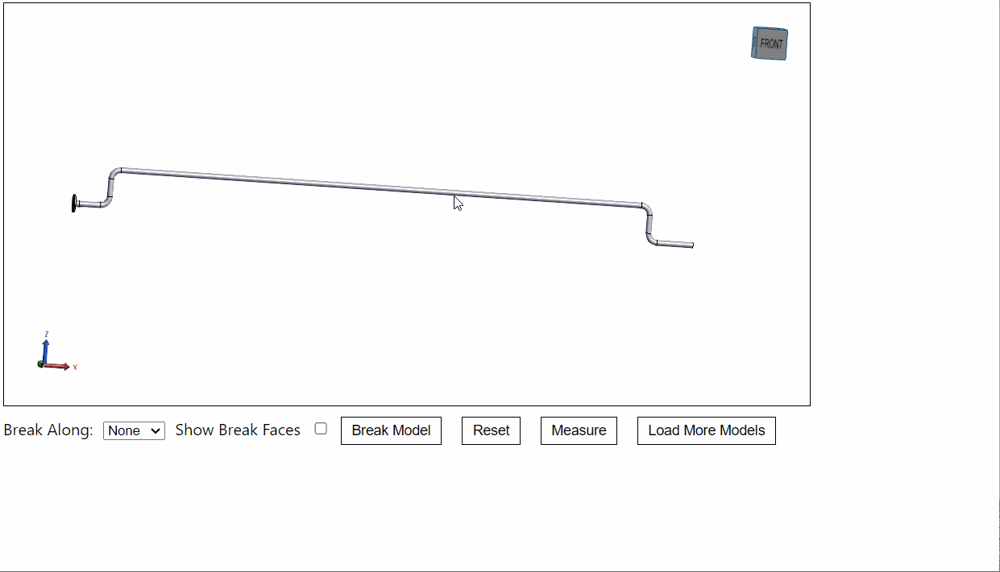
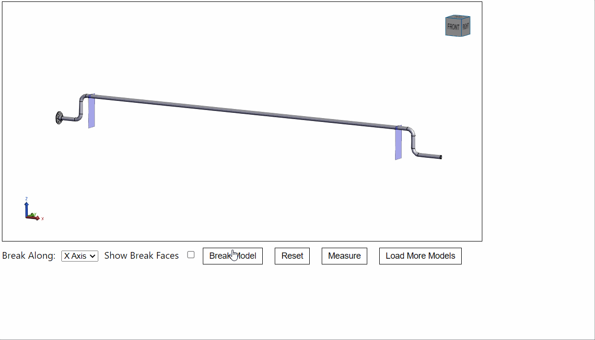
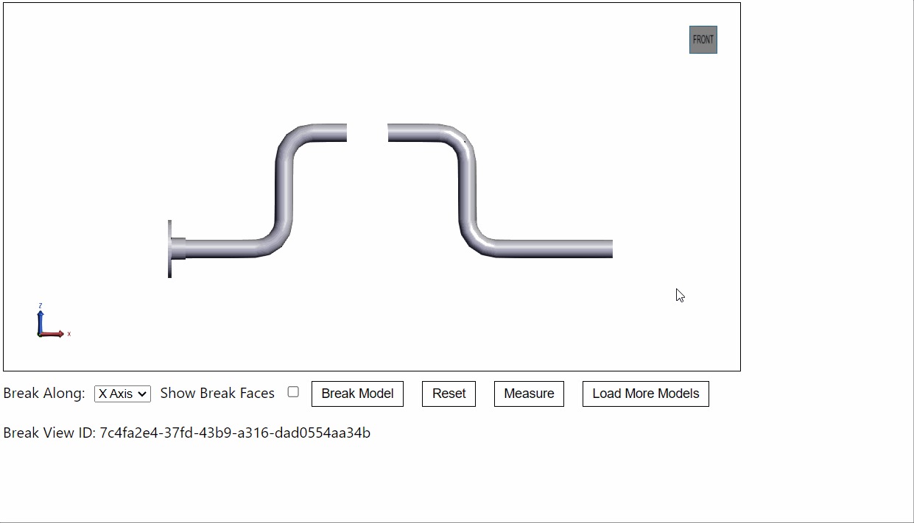

# Model Break Manager

Disclaimer: This is a sample and is not intended for production. This library is not an officially supported part of HOOPS Communicator and provided as-is.

## About

**Model break views** are views of a 3D model which split ("break") the model into multiple segments for easier viewing. These are commonly implemented on long parts when the details in between both ends are not relevant for viewing.  

At this time, HOOPS Communicator does not currently support model break views.

This sample provides a `ModelBreakManager` class to demonstrate one way in which model break views can be implemented. [`csg.js`](https://github.com/evanw/csg.js) is used for client-side boolean operations on the models.

### How it works:

1) Instantiate a new ModelBreakManager.
```
const modelBreakManager = new ModelBreakManager(hwv);
```

2) Activate the cut planes along a specific axis - position these planes at the desired locations for the break. This utilizes HOOPS Communicator's built-in [cutting manager](https://docs.techsoft3d.com/communicator/latest/prog_guide/viewing/scene_attributes/cutting-planes.html) for user interaction.
```
await modelBreakManager.activate(breakPlane);
```



3) Once the cut planes are set, perform the break. This utilizes [`csg.js`](https://github.com/evanw/csg.js) to perform boolean intersections on the Communicator meshes with a "break tool" defined in `BreakTool.js`. The break tool will produce a jagged edge on the broken faces. Meshes are created for each section of a break view and added to the model tree; the break views created are stored under a root break views node, which is a child of the viewer's absolute root node.
```
let viewId = await modelBreakManager.break();
```


### Measuring:
One use case for break views is to display length measurements in a way that is easier to see. Also included in this sample is `MeasureBreakViewOp.js`, a minimal operator that takes break views into account.



### Interface (ModelBreakManager class)

**`constructor(hwv)`**: To create a new ModelBreakManager, pass a HOOPS Web Viewer as an argument.  

**`ModelBreakManager.activate(breakPlane, [planeColor])`**: Activates the cutting planes used to break a model in the UI.  
- Arguments:
  - `breakPlane (string: 'xPlane', 'yPlane', or 'zPlane')`: Define normal axis of the break planes (e.g., 'xPlane' will create two planes normal to the x-axis).
  - `planeColor (Communicator.Color)`: (Optional) Define the color of the cutting planes.  
- Returns: Promise (void).

**`ModelBreakManager.clear()`**: Deactivates any active cutting planes.  
- Returns: Promise (void). 

**`ModelBreakManager.break([showFaces])`**: Create a break view of the model at the cut plane locations.    
- Arguments:
  - `showFaces (boolean)`: (Optional, default: false) If set true, reference meshes of the faces used to break the model will be created.  
- Returns: Promise (uuid string or undefined). 

**`ModelBreakManager.getNode(uuid)`**: Returns the Node ID for the branch of a particular break view, given the view's UUID.
- Arguments:
  - `uuid (string)`: UUID of the break view.
- Returns: Node ID (number) or undefined.

**`ModelBreakManager.getId(nodeId)`**: Returns the UUID of the break view for a particular node.
- Arguments:
  - `nodeId (number)`: Node ID
- Returns: UUID (string) or undefined.

**`ModelBreakManager.showParent()`**: Returns the root node of all break views managed by the ModelBreakManager.
- Returns: Node ID (number).

**`ModelBreakManager.isolate(uuid, time)`**
- Arguments:
  - `uuid (string)`: UUID of the break view.
  - `time (number)`: time, in milliseconds, of the transition to the break view.
- Returns: Promise (void).

## Known limitations and issues:
- Only one broken out section is possible. (The model cannot be broken into multiple sections.)
- The code is not optimized; for example, the boolean intersection is performed on every node (there is no collision detection in place between the break tool and model).
- May not work as expected - with at least one model tested, mesh artifacts were produced and the boolean intersection was not performed as intended (bnc model).

